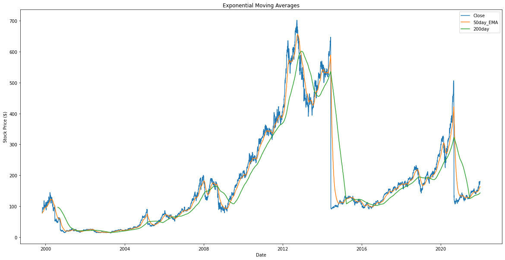
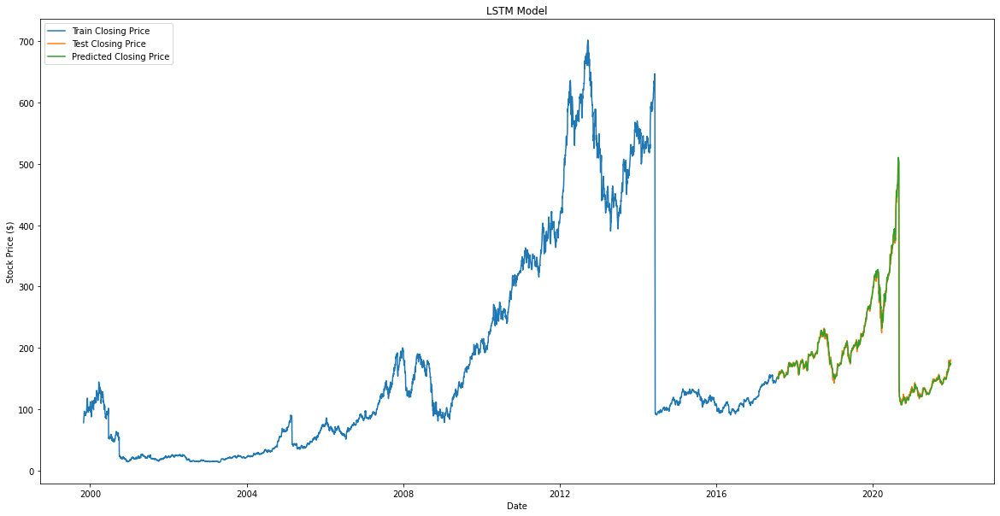
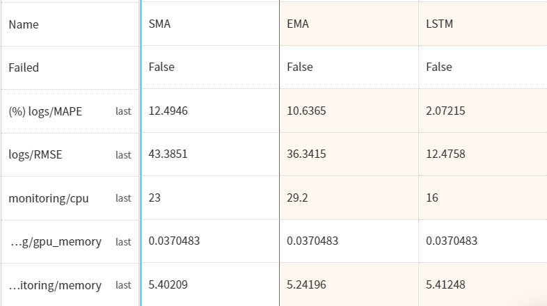

# Predicting Stock Prices Using Machine Learning 

Article: https://neptune.ai/blog/predicting-stock-prices-using-machine-learning

Code: https://github.com/YiLi225/NeptuneBlogs/blob/main/Predicting_StockPrices.py

## Get data from Alpha Vantage

https://www.alphavantage.co/

## Create new neptune project

## Simple Moving Average

## Exponential Moving Average

## Comparison of the SMA and EMA prediction performance

## Predicting stock prices with an LSTM model

## Comparison of SMA, EMA, and LSTM models 

